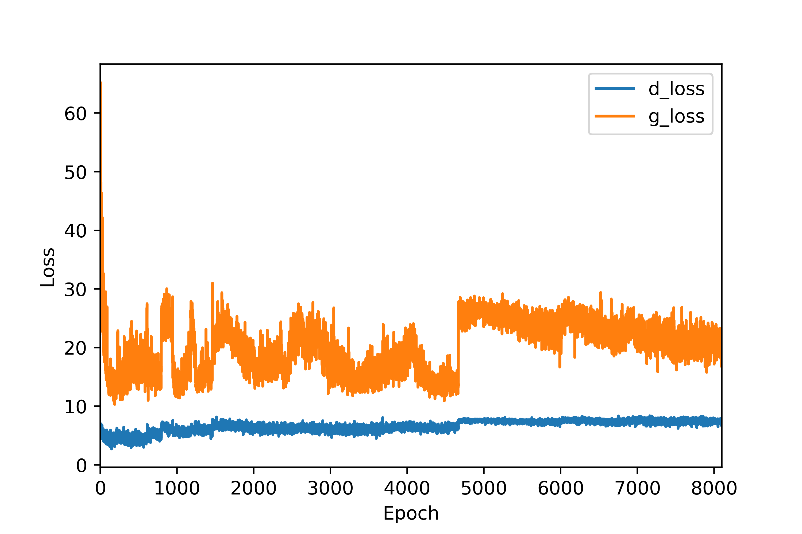
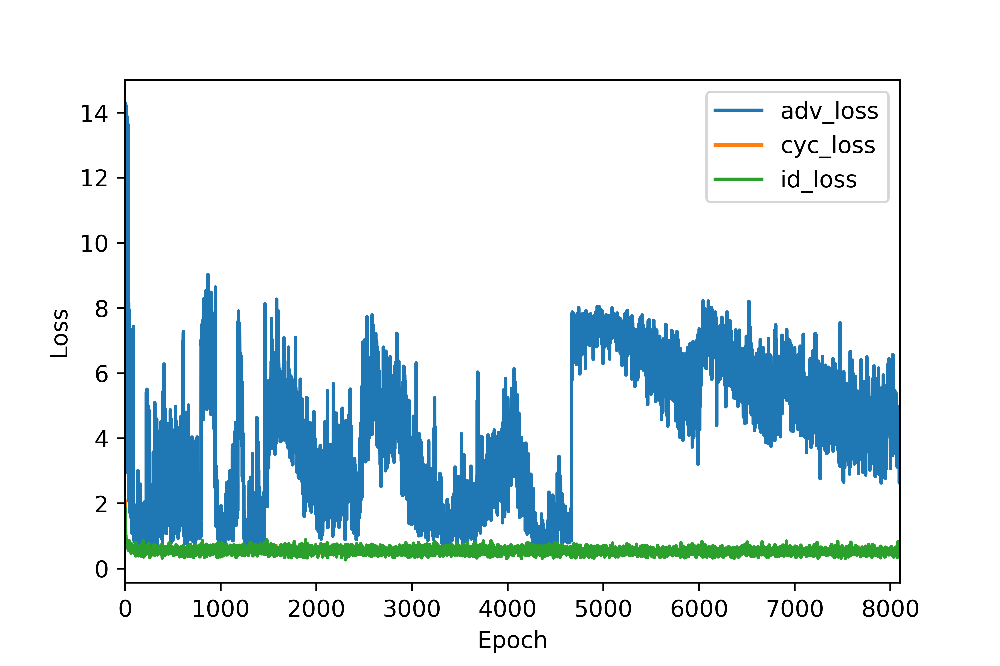

# DL-VoiceChanger #
## Introduction ##
我們的目標是將一個人的聲音轉換成另一個人的聲音，希望透過訓練出來的模型，在輸入來源音訊 S 後，可以輸出成目標音訊 T。
首先，我們會將很一段或多段.wav音訊檔透過 [WORLD Vocoder](https://github.com/JeremyCCHsu/Python-Wrapper-for-World-Vocoder) 擷取特徵後轉換成神經網路可以學習的資料型態 tensor，並且參考 [CycleGAN](https://junyanz.github.io/CycleGAN/) 這個對抗式生成模型架構做訓練，分別選擇 [U-Net](https://lmb.informatik.uni-freiburg.de/people/ronneber/u-net/) generator 和 Patched discriminator([CycleGAN VC2](http://www.kecl.ntt.co.jp/people/kaneko.takuhiro/projects/cyclegan-vc2/index.html)) 做為我們的生成器和鑑別器。

## Experiment ##
為了達成我們的目標，我們進行了多次實驗，以下是我們的實驗內容：
* __One-shot learning__ :
在這個實驗當中我們只在來源資料集T與目標資料集S當中選擇一筆資料作為訓練資料。
  * 初始設定 :
    * RMSprop as generator's optimizer, and SGD as discriminator's optimizer. Initial learning rate = 5e-5.
    * Losses : Two-Step Adversarial Losses(MSE), Cycle-consistency loss(MAE), Identity-mapping loss(MAE).
  * The "G only" Phase :
    * 在這個階段，我們只訓練 Generator。
  * The "Loss change" Phase :
    * 這個階段中的 Two-Step Adversarial Losses 改使用 Binary cross entropy(BCE)。
* __一般訓練__ :
在這個實驗當中我們使用來源資料集T與目標資料集S中的所有資料作為訓練資料。
  * 初始設定
    * RMSprop as generator's optimizer, and SGD as discriminator's optimizer. Initial learning rate = 5e-5.
    * Losses : Two-Step Adversarial Losses(MSE), Cycle-consistency loss(MAE), Identity-mapping loss(MAE).
## Train Model
在這個實驗當中我們只在來源資料集T與目標資料集S當中選擇一筆資料作為訓練資料。
  * 初始設定 :
    * RMSprop as generator's optimizer, and SGD as discriminator's optimizer. Initial learning rate = 5e-5.
    * Losses : Two-Step Adversarial Losses(BCE), Cycle-consistency loss(MSE), Identity-mapping loss(MSE).  

訓練結果呈現：

## Summary ##
雖然我們的設備與時間無法支持我們進行較為完整的實驗與訓練，但是我們仍然在實做中學習到許多知識。我們會持續學習並希望未來能夠真正達到我們的目標。
## Reference ##
* [PARALLEL-DATA-FREE VOICE CONVERSION USING CYCLE-CONSISTENT ADVERSARIAL NETWORKS](https://arxiv.org/pdf/1711.11293.pdf) (Takuhiro Kaneko, Hirokazu Kameoka. 2017.)
* [CYCLEGAN-VC2: IMPROVED CYCLEGAN-BASED NON-PARALLEL VOICE CONVERSION](https://arxiv.org/pdf/1904.04631.pdf) (Takuhiro Kaneko, Hirokazu Kameoka, Kou Tanaka, Nobukatsu Hojo)
* [Keras-GAN](https://github.com/eriklindernoren/Keras-GAN) (eriklindernoren)
* [Unpaired Image-to-Image Translation using Cycle-Consistent Adversarial Networks](https://arxiv.org/pdf/1703.10593.pdf) (Jun-Yan Zhu∗ Taesung Park∗ Phillip Isola Alexei A. Efros)
* [U-Net: Convolutional Networks for Biomedical Image Segmentation](https://arxiv.org/pdf/1505.04597.pdf) (Olaf Ronneberger, Philipp Fischer, Thomas Brox)
* [Voice Converter CycleGAN](https://github.com/leimao/Voice_Converter_CycleGAN) (Lei Mao, University of Chicago)
## Authors
* National Chengchi University, NCCU
  * 資管四 105306088 陳昌碩
    * 建立模型
    * 實驗設計與進行
    * 資料蒐集
  * 資管四 105306002 林貞妮
    * 文獻探討與驗證
  * 廣告四 105405073 陳筑均
    * 報告
    * 資料蒐集
  * 資管一 108306036 羅永富
    * 簡報製作
    * 資料蒐集
